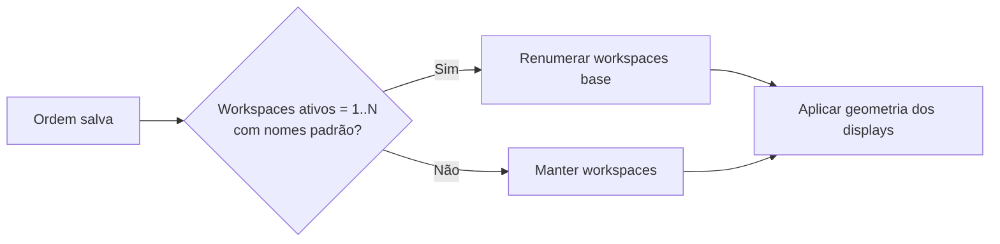

# Omarchy Display Order

Ordene visualmente os monitores do Omarchy e mantenha a disposição lógica e a escala do Hyprland em sincronia.

## Visão geral

O plugin adiciona numeração e arrastar-e-soltar à seção **Displays** do Omarchy. Ele reordena e identifica somente displays **habilitados e não espelhados**.

```text
Antes                         Depois de arrastar o Monitor 2
1  Monitor 1                  1  Monitor 2
2  Monitor 2                  2  Monitor 1
```

Ao soltar uma linha, a primeira posição vira o monitor lógico mais à esquerda; as demais seguem da esquerda para a direita. O plugin muda a geometria dos displays, não move janelas entre saídas físicas.

### Recursos

- Arrastar-e-soltar para reordenar displays.
- Identificação do monitor físico ao manter o cursor sobre uma linha.
- Posicionamento lógico automático, considerando escala e rotação.
- Escala no monitor em foco.
- Ajuste de brilho e tamanho do texto.
- Ativar ou desativar monitores (o último display ativo não pode ser desativado).
- Persistência da ordem e restauração segura após recarregamentos.

## Exemplo visual

Arraste uma linha para alterar a ordem lógica da esquerda para a direita:


## Requisitos

- Omarchy 4.0.1-1, com o sistema de plugins e os comandos `omarchy plugin`.
- Hyprland 0.56.2.
- `hyprctl`, `jq`, `flock` e `luac` (requisitos de execução do plugin; `luac` é necessário para validar e atualizar `monitors.lua`).

Estas são as versões usadas no desenvolvimento e na validação. A compatibilidade com outras versões de Omarchy ou Hyprland não foi testada.

## Instalação

Instale pelo mecanismo oficial de plugins do Omarchy:

```bash
omarchy plugin add https://github.com/rsendres/omarchy-display-order.git --enable
```

## Uso

Abra **Setup → Display**. Em **DISPLAYS**, arraste as linhas numeradas até a ordem desejada.

### Identificar um display

Mantenha o ponteiro sobre uma linha por dois segundos. O número da linha aparece no canto superior esquerdo do display físico correspondente e permanece enquanto o cursor estiver sobre a linha. Ele desaparece ao sair; durante o arrastar-e-soltar, a identificação fica desativada. O plugin usa o nome da saída do Hyprland, como `DP-2` ou `HDMI-A-1`.

### Escala, brilho e texto

- **Scale** atua no monitor em foco e só pode ser aplicado com um `order.json` válido e com o monitor em foco habilitado e não espelhado.
- As predefinições de escala são reduzidas à unidade válida mais próxima de `1/120`. A interface mostra duas casas decimais; a configuração gerada preserva seis algarismos significativos.
- **Brightness** ajusta o brilho por meio de `omarchy-brightness-display` quando o controle está disponível; a disponibilidade é determinada pelo retorno válido desse comando.
- **Text size** ajusta o tamanho do texto na interface.
- Os controles de habilitar/desabilitar monitor respeitam a regra de que sempre deve restar um display ativo.

### Workspaces

Durante uma reordenação explícita, o plugin pode renumerar temporariamente apenas os workspaces base padrão elegíveis quando o conjunto ativo for exatamente `1..N` **e** os nomes corresponderem aos padrões. Workspaces nomeados, mistos ou especiais não são renumerados nem gerenciados permanentemente pelo plugin. A alteração não move janelas entre saídas físicas.



## Persistência e restauração

- `order.json` é a fonte da ordem preferida dos monitores.
- A geometria ao vivo pode usar coordenadas calculadas. As regras persistidas usam `0x0` no primeiro monitor e `auto-right` nos seguintes.
- Na inicialização, a restauração exige uma ordem salva e o contexto de sessão/runtime do Hyprland. Ela roda uma vez por assinatura de sessão do Hyprland; se falhar, não fica tentando indefinidamente na mesma sessão.
- Um bloco gerenciado em `monitors.lua` torna os recarregamentos seguros.

## Recuperação e desinstalação

Para remover **somente** o bloco `monitors.lua` gerenciado pelo plugin:

```bash
scripts/reorder-displays --remove-config-block
```

Isso não é uma reversão completa da configuração. `--restore-last` tenta restaurar o último snapshot de layout ao vivo salvo pelo plugin; exige que esse snapshot exista e que o Hyprland esteja acessível, e não oferece garantia de recuperação offline.

Ao reescrever `~/.config/hypr/monitors.lua`, o plugin mantém as cinco cópias de backup mais recentes criadas por ele, com timestamp, ao lado do arquivo. Backups de outras ferramentas não são gerenciados.

Depois, remova o plugin pelo Omarchy:

```bash
omarchy plugin remove omarchy-display-order.display-order
```

## Limitações

- O tratamento automático avançado de hotplug ainda não foi implementado.
- A restauração depende de `order.json` e de um contexto de sessão/runtime válido do Hyprland.
- Fora da renumeração temporária de workspaces base padrão elegíveis durante uma reordenação explícita, o plugin não cria nem gerencia permanentemente workspaces arbitrários.

## Desenvolvimento

Execute os checks a partir da raiz do plugin:

```bash
bash -n scripts/reorder-displays
tests/test_reorder_displays.sh
bash tests/test_scale_normalization.sh
luac -p "$HOME/.config/hypr/monitors.lua"
git diff --check
omarchy plugin validate .
```

Se `qmlformat` estiver instalado, formate ou valide os arquivos QML antes de contribuir:

```bash
qmlformat -i Panel.qml Service.qml MonitorIdentifier.qml
```
