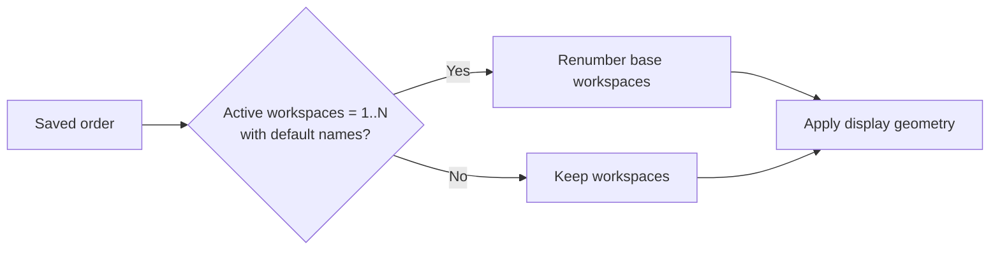

# Omarchy Display Order

Visually reorder Omarchy monitors and keep Hyprland's logical layout and scaling in sync.

🇺🇸 **English** | [🇧🇷 Português](README.pt-BR.md)

## Overview

The plugin adds numbering and drag-and-drop ordering to Omarchy's **Displays** section. It reorders and identifies only **enabled, non-mirrored displays**.

```text
Before                         After dragging Monitor 2
1  Monitor 1                  1  Monitor 2
2  Monitor 2                  2  Monitor 1
```

When a row is dropped, the first position becomes the leftmost logical monitor; the remaining rows follow from left to right. The plugin changes display geometry; it does not move windows between physical outputs.

### Features

- Drag-and-drop display ordering.
- Physical display identification by hovering over a row.
- Automatic logical positioning that accounts for scale and rotation.
- Scaling on the focused monitor.
- Brightness and text-size controls.
- Monitor enable/disable controls (the final active display cannot be disabled).
- Persistent ordering and safe restoration after reloads.

## Visual example

Drag a row to change the logical order from left to right:


## Requirements

- Omarchy 4.0.1-1, with its plugin system and `omarchy plugin` commands.
- Hyprland 0.56.2.
- `hyprctl`, `jq`, `flock`, and `luac` (runtime requirements; `luac` is required to validate and update `monitors.lua`).

These are the versions used during development and validation. Compatibility with other Omarchy or Hyprland versions has not been tested.

## Installation

Install through Omarchy's official plugin mechanism:

```bash
omarchy plugin add https://github.com/rsendres/omarchy-display-order.git --enable
```

## Usage

Open **Setup → Display**. In **DISPLAYS**, drag the numbered rows into the desired order.

### Identify a display

Hover over a row for two seconds. Its row number appears in the upper-left corner of the matching physical display and remains visible while the pointer stays over the row. It disappears on exit; identification is disabled during drag-and-drop. The plugin uses the Hyprland output name, such as `DP-2` or `HDMI-A-1`.

### Scale, brightness, and text size

- **Scale** acts on the focused monitor and requires a valid saved order in `order.json` and an enabled, non-mirrored focused monitor.
- Scale presets are reduced to the nearest mode-valid `1/120` unit. The UI shows two decimal places; the generated configuration preserves six significant digits.
- **Brightness** adjusts brightness through `omarchy-brightness-display` when control is available; availability is determined by that command returning a valid value.
- **Text size** adjusts the interface text size.
- Monitor enable/disable controls enforce the rule that at least one display must remain active.

### Workspaces

During an explicit reorder, the plugin may temporarily renumber only eligible default base workspaces when the active workspace set is exactly `1..N` **and** their names match the defaults. Named, mixed, and special workspaces are neither renumbered nor permanently managed by the plugin. The change does not move windows between physical outputs.



## Persistence and restoration

- `order.json` is the source of the preferred monitor order.
- Live geometry may use calculated coordinates. Persisted rules use `0x0` for the first monitor and `auto-right` for the following monitors.
- At startup, restoration requires a saved order and Hyprland session/runtime context. It runs once per Hyprland session signature; if it fails, it is not retried endlessly during that session.
- A managed block in `monitors.lua` makes reloads safe.

## Recovery and uninstall

To remove **only** the plugin-managed `monitors.lua` block:

```bash
scripts/reorder-displays --remove-config-block
```

This is not a full configuration rollback. `--restore-last` requires a saved live-layout snapshot and accessible Hyprland, and makes a best-effort attempt to restore it; it does not provide offline recovery.

When rewriting `~/.config/hypr/monitors.lua`, the plugin keeps the five newest timestamped backups it created alongside the file. Backups created by other tools are not managed.

Then remove the plugin through Omarchy:

```bash
omarchy plugin remove omarchy-display-order.display-order
```

## Limitations

- Advanced automatic hotplug handling has not been implemented.
- Restoration depends on `order.json` and valid Hyprland session/runtime context.
- Outside the temporary renumbering of eligible default base workspaces during an explicit reorder, the plugin does not impose workspace numbering, create workspaces, or permanently manage arbitrary workspaces.

## Development

Run these checks from the plugin root:

```bash
bash -n scripts/reorder-displays
tests/test_reorder_displays.sh
bash tests/test_scale_normalization.sh
luac -p "$HOME/.config/hypr/monitors.lua"
git diff --check
omarchy plugin validate .
```

If `qmlformat` is installed, format or validate the QML files before contributing:

```bash
qmlformat -i Panel.qml Service.qml MonitorIdentifier.qml
```
